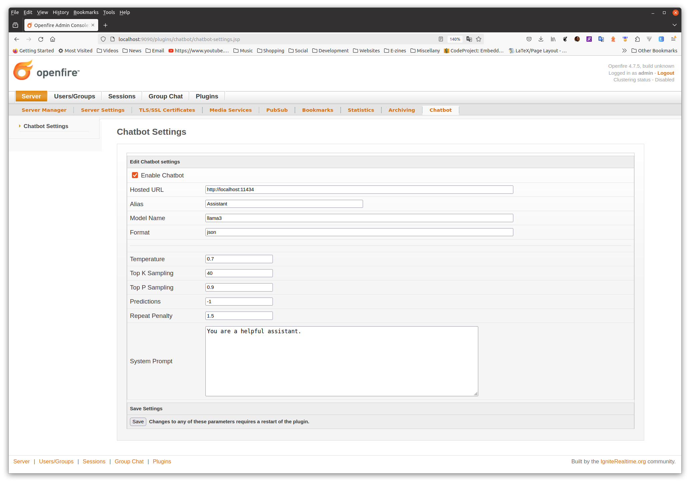

# Chatbot
Chatbot for Openfire.
This plugin is a wrapper to a hosted [Ollama AI](https://ollama.com/) Inference server for LLM chat models. It uses the HTTP API to create a chatbot in Openfire which will engage in XMPP chat and groupchat conversations.

## Installation

copy chatbot.jar to the plugins folder

## Configuration


### Enable Chatbot
Enables or disables the plugin. Reload plugin or restart Openfire if this or any other settings are changed.

### Host
The URL to the remote server to be used. The plugin will assume that remote server has the correct LLaMA model and configuration. It will send requests to this URL.

### Alias
Set an alias for the model. The alias will be returned in chat responses.

### System Prompt
Prompting large language models like Llama 2 is an art and a science. Set your system prompt here. Default is "You are a helpful assistant"

### Predictions
Set the maximum number of tokens to predict when generating text. Note: May exceed the set limit slightly if the last token is a partial multibyte character. When 0, no tokens will be generated but the prompt is evaluated into the cache. Default is 256

### Temperature
Adjust the randomness of the generated text (default: 0.5).

### Top K Sampling
Limit the next token selection to the K most probable tokens (default: 40).

### Top P Sampling
Limit the next token selection to a subset of tokens with a cumulative probability above a threshold P (default: 0.95).

The plugin will create an Openfire user called assistant (by default). The user can be engaged with in chat or groupchats from any XMPP client application like Spark, Converse or Conversations.

### Chat
Add Assistant as a contact and start a chat conversation
````
Mar 8, 2024, 16:46:14: Explain in 50 words, how to make a chatbot.
Assistant 16:46: Creating a chatbot involves several steps: First define its purpose and functionalities using natural language processing (NLP) tools like DialogfloworRasa. Next design the conversational flow with intentsandentitiesusingdialogue trees or storyboards. Then developthe bot logic by integrating itwithchat platforms such as Facebook Messenger,Slack or Telegram APIs. Finally test and refine your chatbot through continuous user interactions to improve its performance over time.
````
### Group Chat
When enabled, the chatbot joins all chatrooms created
